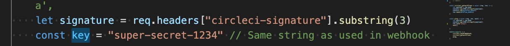

# Splunk Observability Webhook

## Introduction

The application is written as an interim solution to ingest metrics from some of the CICD tools. 
- Circleci
- Github
- Gitlab
  

## How To Use

The application has been tested with ngrok provide the URL that is required by the CICD webhook. 

### Pre-Requisite

- Ensure the secret `key` used inside the controller code tally matches the `secret token`  in the Github/Circleci
  
  

- Ensure npm is installed. Code is developed and tested on npm `v8.0.3`

### To Run

- git clone the repository and cd into the repository.

- `npm install`

- `npm run start` (use ngrok or deploy somewhere nice - note the deployment URL)

- configure the publicly accessible url: `https://ngrok-generated-url/v1/cicd/ci-webhook` or `https://ngrok-generated-url/v1/cicd/gh-webhook` or `https://ngrok-generated-url/v1/cicd/ci-webhook` or `https://ngrok-generated-url/v1/cicd/gl-webhook` into webhooks setting in ci=CircleCI, gh=Github, gl=Gitlab 
  
  - In future as more endpoints are added, please go through the routes to determine the new endpoint.

- Create a .env file and provide the following values
  1.  SIGNALFX_REGION=<SIGNALFX_REGION>
  2. SIGNALFX_TOKEN=<SIGNALFX_TOKEN>
  3. PORT=5000
   
- Start the application with the following command
  - `node server.js`

## Metrics 

### Circleci

| Workflow rum metrics | Description |   
|--- | ---|
gauge_circleci_total_count_pipelines_payload |Total number of workflows run
cumulative_circleci_total_time_pipelines_payload | Total time consumed of workflows run

| Workflow job metrics | Description | 
| --- | --- |
counter_circleci_total_time_jobs_payload | Total time consumed of the jobs run (sec)
gauge_circleci_total_count_jobs_payload | Total number of job run
cumulative_circleci_total_time_jobs_payload | Total time consumed of the jobs run (sec)

 

### Github

| Workflow job metrics | Description |   
|--- | ---|
gauge_github_total_count_pipelines_payload |Total number of workflows run
cumulative_github_total_time_pipelines_payload | Total time consumed of workflows run

| Workflow job metrics | Description | 
| --- | --- |
counter_github_total_time_jobs_payload | Total time consumed of the jobs run (sec)
gauge_github_total_count_jobs_payload | Total number of job run
cumulative_github_total_time_jobs_payload | Total time consumed of the jobs run (sec)

### Gitlab

| Workflow job metrics | Description |   
|--- | ---|
gauge_gitlab_total_count_pipelines_payload |Total number of workflows run
cumulative_gitlab_total_time_pipelines_payload | Total time consumed of workflows run

| Workflow job metrics | Description | 
| --- | --- |
counter_gitlab_total_time_jobs_payload | Total time consumed of the jobs run (sec)
gauge_gitlab_total_count_jobs_payload | Total number of job run
cumulative_gitlab_total_time_jobs_payload | Total time consumed of the jobs run (sec)
